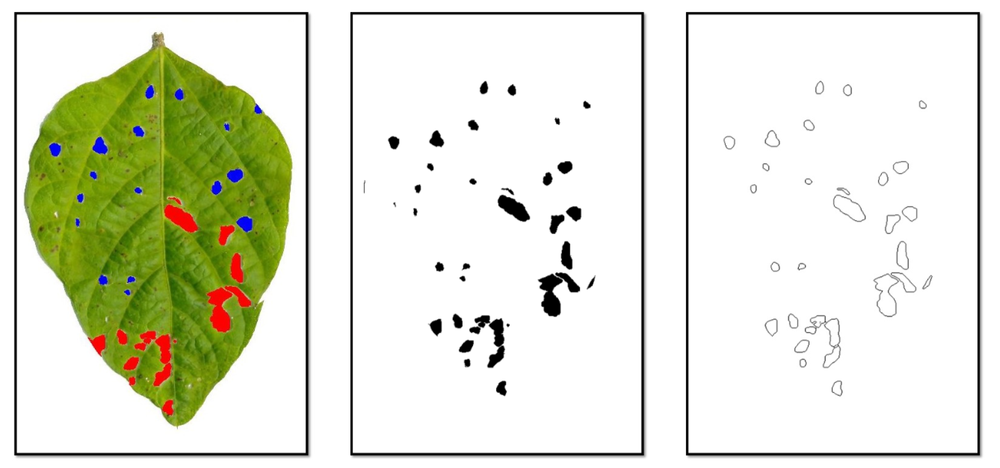

# Analysis of Descriptors for Automatic Classification of Damaging Agents in Brazilian Soybean Leaflets

This repository contains the code (Matlab) and the data created in my undergraduate thesis in **2011**.

## Introduction
Many of the difficulties in managing soybean tillage are related to the identification of insect/pests harmful to the plant since tillage can be attacked by a wide range of such agents. By identifying the most common agents that cause damages to the leaflets, we can obtain more knowledge about appropriate strategies of control. This project presents a method for classification of the main agents that cause damages to soybean leaflets, i.e., beetles and caterpillars.

## Image Preprocessing
The image preprocessing has two steps: image filtering and contour extraction. The figures below show the labeled image and the results of these two steps.

## Feature Extraction

From the contours and area of the damages, features are extracted using several descriptors. Two of them model each contour as a complex network and extract the features based on the connectivity and the joint degree of the network. The others are the shape descriptors of Fourier, Wavelet and of Zernike.

## Classification
The Support Vector Machines (SVM) classifier algorithm is used to classify the features.

## Dataset

The dataset was created with 178 samples of soybean leaflets manually labeled by specialists. From that, we generated 1780 damages images, in which 1170 samples were of beetles and 610 of caterpillars. So the dataset is imbalanced.

## Validation

We did hyperparameter tunning to find the best values of SVM parameters $C$ and $\gamma$. We also used leave-one-out cross-validation to validate the model. In this cross-validation, each learning set is created by taking all the samples except one, the test set being the sample left out. 

## Results
In the experiments, we analyzed the different descriptors and thresholds which model the network and the proposed method with joint degree descriptors achieved accuracy greater than 90%. The method with descriptors of Fourier presented an average accuracy of 90% and requires a smaller number of parameters than the descriptors of joint degree. The other descriptors did not show satisfactory results (equal or greater than 90%) with the classification algorithm used.
